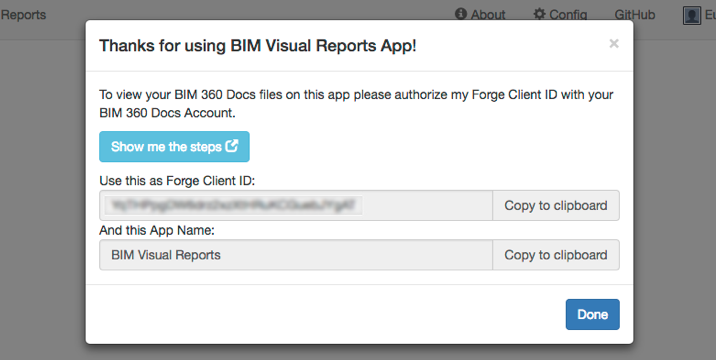

# bim360appstore-viewer-nodejs-visual.reports

This sample application demonstrates how to extract properties from elements and generate a project dashboard

Project based on Jim Awe - LMVNavTest (Depracated)
[https://github.com/JimAwe/LmvNavTest](https://github.com/JimAwe/LmvNavTest)

### Thumbnail

### Live version

[https://bim360reports.autodesk.io](https://bim360reports.autodesk.io/)

# Setup

For using this sample, you need to log into your Autodesk developer account. Visit the [Forge Developer Portal](https://developer.autodesk.com) and sign up for an account, then [create an app](https://developer.autodesk.com/myapps/create). When asked for the 'callback URL' in your new app, use **http://localhost:3000/api/forge/callback/oauth**. Finally take note of the **Client ID** and **Client Secret**.

### Run locally

Install [NodeJS](https://nodejs.org).

Clone this project or download it. It's recommended to install [GitHub desktop](https://desktop.github.com/). To clone it via command line, use the following (**Terminal** on MacOSX/Linux, **Git Shell** on Windows):

    git clone https://github.com/autodesk-forge/bim360appstore-viewer-nodejs-visual.reports

To run it, install the required packages, set the enviroment variables with your client ID & secret and finally start it. Via command line, navigate to the folder where this repository was cloned and use the following:

Mac OSX/Linux (Terminal)

    npm install
    export FORGE_CLIENT_ID=<<YOUR CLIENT ID FROM FORGE DEVELOPER PORTAL>>
    export FORGE_CLIENT_SECRET=<<YOUR FORGE CLIENT SECRET>>
    export FORGE_CALLBACK_URL=<<YOUR CALLBACK URL FROM FORGE DEVELOPER PORTAL>>
    npm run dev

Windows (use <b>Node.js command line</b> from Start menu)

    npm install
    set FORGE_CLIENT_ID=<<YOUR CLIENT ID FROM FORGE DEVELOPER PORTAL>>
    set FORGE_CLIENT_SECRET=<<YOUR FORGE CLIENT SECRET>>
    set FORGE_CALLBACK_URL=<<YOUR CALLBACK URL FROM FORGE DEVELOPER PORTAL>>
    npm run dev

Open the browser: [http://localhost:3000](http://localhost:3000).

**Important:** do not use **npm start** locally, this is intended for PRODUCTION only with HTTPS (SSL) secure cookies.

### Deploy on Heroku

To deploy this application to Heroku, the **Callback URL** & **redirect_uri** must use your .herokuapp.com address. After clicking on the button below, at the Heroku Create New App page, set your Client ID & Secret and the correct callback URL.

Watch [this video](https://www.youtube.com/watch?v=Oqa9O20Gj0c) on how deploy this sample to Heroku.

## Packages used

All Autodesk Forge NPM packages are included by default, see complete list of what's available at [NPM website](https://www.npmjs.com/browse/keyword/autodesk). OAuth, Model Derivative and OSS are used. Some other non-Autodesk packaged are used, including [express](https://www.npmjs.com/package/express) and its session/cookie middlewares ([express-session](https://www.npmjs.com/package/express-session) and [cookie-parser](https://www.npmjs.com/package/cookie-parser)) for user session handling. The front-end uses [bootsrap](https://www.npmjs.com/package/bootstrap) and [jquery](https://www.npmjs.com/package/jquery).

# Tips & tricks

For local development/testing, consider use [nodemon](https://www.npmjs.com/package/nodemon) package, which auto restart your node application after any modification on your code. To install it, use:

    sudo npm install -g nodemon

Then, instead of <b>npm run dev</b>, use the following:

    npm run nodemon

Which executes **nodemon server.js --ignore www/**, where the **--ignore** parameter indicates that the app should not restart if files under **www** folder are modified.

## Troubleshooting

After installing Github desktop for Windows, on the Git Shell, if you see a ***error setting certificate verify locations*** error, use the following:

    git config --global http.sslverify "false"

# License

This sample is licensed under the terms of the [MIT License](http://opensource.org/licenses/MIT).
Please see the [LICENSE](LICENSE) file for full details.

## Written by

Forge Partner Development
